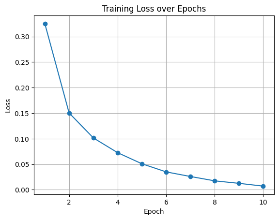
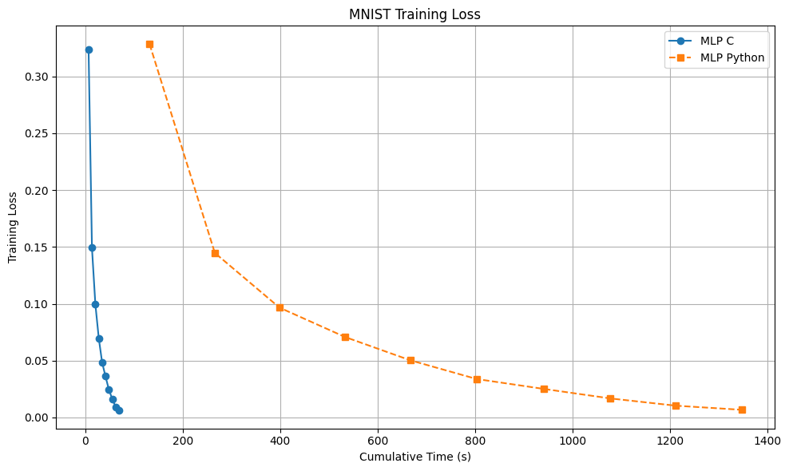

# MNIST MLP

This project implements a simple Multi-Layer Perceptron (MLP) neural network in C to classify the MNIST dataset. The MNIST dataset consists of 28x28 pixel grayscale images of handwritten digits (0-9) and their corresponding labels. This also includes a simpler version of the MLP code trained on the trivial XOR problem. 

---

## Table of Contents

1. [Setup and Usage](#setup-and-usage)
2. [Overview](#overview)
3. [Initialisation](#initialisation)
4. [Forward](#forward)
5. [Backward](#backward)
6. [Benchmarking](#benchmarking)
7. [References](#references)

---

## Setup and Usage

### **Data**
The MNIST dataset can be downloaded using the following Makefile command

```bash
make data_download
```

### **Compilation**

Use the following command to compile the program:

```bash
gcc -o mnist_mlp mnist_mlp.c -lm
```

There is also a Makefile for your convenience allowing you to compile with 

```bash
make build_mnist

make build_simple
```

### **Running**

```bash
make run_mnist

# or

./mnist_mlp

make run_simple

# or

./mnist_simple
```

This should give the expected output 

```bash
Loading training data...
Loading test data...
Initializing neural network...
Training neural network...
Epoch 1, Loss: 0.325294 Time: 7.291637
Epoch 2, Loss: 0.150378 Time: 7.499248
....
Epoch 9, Loss: 0.012575 Time: 7.036349
Epoch 10, Loss: 0.007128 Time: 7.339333
Testing neural network...
Test Accuracy: 95.86%
```

## Overview

A **Multi-Layer Perceptron (MLP)** is a type of feedforward neural network consisting of at least three layers:
- **Input Layer:** 784 neurons (representing the 28x28 pixels of an MNIST image).
- **Hidden Layer:** 128 neurons with a relu activation function.
- **Output Layer:** 10 neurons with a softmax activation function (representing digits 0-9).

## Initialisation
For this network we use Xavier initialisation, which is a method for setting the initial values of the weights in a neural network. This method sets the initial weights to random values drawn from a normal distribution with a mean of 0 and a standard deviation of sqrt(1/input_size), where input_size is the number of neurons in the previous layer, and the bias set to 0. This helps to keep the scale of the gradients roughly the same in all layers, which can help to prevent the gradients from exploding or vanishing during training.

```python
# Xavier Initialisation
W1 = np.random.randn(hidden_size, input_size) * np.sqrt(1/input_size)
b1 = np.zeros((hidden_size, 1))
``` 

## Forward
In forward propagation, the network computes the output for a given input by passing data through the hidden layer and then the output layer.

For each layer:

- The weighted sum of inputs is calculated.
- An activation function is applied to produce the output, this allows us to handle more complex, non-linear problems.
- The output is passed to the next layer as input.

```python
#Forward Pass

# 1. Compute the first linear transformation
z1 = W1 * x + b1

# 2. Apply ReLU activation function
a1 = ReLU(z1)

# 3. Compute the second linear transformation
z2 = W2 * a1 + b2

# 4. Apply Softmax activation function to get predictions
y_pred = softmax(z2)

# 5. Compute Cross-Entropy Loss
loss = cross_entropy(y_pred, y_true)
```

- W1, b1: Weights and biases for the first layer.
- W2, b2: Weights and biases for the second layer.
- ReLU(z): Activation function defined as ReLU(z) = max(0, z).
- softmax(z): Converts logits to probabilities.
- y_true: True labels (one-hot encoded).
- cross_entropy(p, q): Computes the loss between predicted probabilities p and true labels q.

## Backward

In order to train the network, we need to compute the gradients of the loss function with respect to the weights and biases. This is done using backpropagation, which involves computing the gradients of the loss with respect to the output of each layer. 

### Loss Function
In this example we are using the cross-entropy loss function. Cross-entropy loss is a loss function commonly used in classification tasks within machine learning. It quantifies the difference between the true probability distribution of the labels and the predicted probability distribution generated by the model.

```math
L = -\sum_{k=1}^{10} y_k \log(a^{(2)}_k)
```

Where:
- L is the loss.
- y_k  is the actual label (one-hot encoded).
- a_k  is the predicted probability for class  k.

What this is doing is summing over all classes and taking the negative log of the predicted probability for the true class. 

We take the negative log of the predicted probability for the true class because the softmax function outputs probabilities between 0 and 1, and the log function is negative for values between 0 and 1. 

This means that the loss will be high when the predicted probability for the correct class is low and low when the predicted probability is high.

### Gradients

```python
# 6. Compute the gradient of loss with respect to z2 (pre-activation of output layer)
d_z2 = y_pred - y_true

# 7. Compute gradients for W2 and b2
d_W2 = d_z2 * a1^T
d_b2 = d_z2

# 8. Backpropagate through the second linear layer
d+a1 = W2^T * d_z2

# 9. Compute the gradient of ReLU activation
d_z1 = d_a1 * (1 if z > 0 else 0)

# 10. Compute gradients for W1 and b1
d_W1 = d_z1 * x^T
d_b1 = d_z1
```

- ^T: Denotes the transpose of a matrix.
- dz2: Gradient of loss with respect to z2.
- dW2, db2: Gradients of loss with respect to W2 and b2.
- da1: Gradient of loss with respect to activations a1.
- dz1: Gradient of loss with respect to z1.
- dW1, db1: Gradients of loss with respect to W1 and b1.

## Data Processing

The MNIST dataset consists of 60,000 training images and 10,000 test images. Each image is a 28x28 pixel grayscale image of a handwritten digit (0-9). The images are stored as 1D arrays of length 784 (28x28), with pixel values ranging from 0 to 255. We use the [Kaggle](https://www.kaggle.com/api/v1/datasets/download/hojjatk/mnist-dataset) verion of the dataset which is already split into training and test sets.

Data images are read in and processed using `read_mnist_images` function:
```c
void read_mnist_images(const char *filename, double **images, int num_images)
```

**Data Images Processing Steps:**
1.	Open the File: 
    - The image file is opened in binary read mode.
2.	Read Header Information:
	- Magic Number: Used to identify the file type.
	- Number of Images: Total images in the file.
	- Rows and Columns: Dimensions of each image (28x28 pixels).
3.	Read Image Data:
	- Each image is read pixel by pixel.
	- Pixel values range from 0 to 255.
	- Normalization: Pixel values are normalized to the range [0, 1] by dividing by 255.0.
	- The normalized pixel values are stored in a dynamically allocated array for each image.
4.	Close the File: 
    - After reading all images, the file is closed.

The labels are read using the `read_mnist_labels` function:

```c
void read_mnist_labels(const char *filename, int *labels, int num_labels)
```

**Data Labels Processing Steps:**
1.	Open the File: 
    - The label file is opened in binary read mode.
2.	Read Header Information:
    - Magic Number: Used to identify the file type.
    - Number of Labels: Total labels in the file.
3.	Read Label Data:
    - Each label is read as an unsigned byte and converted to an integer.
	- The labels range from 0 to 9, representing the digits.
4.	Close the File:
    - After reading all labels, the file is closed.

**Data Structure:**
- Images: Stored as a 2D array where each row represents an image and each column represents a pixel.
- Labels: Stored as a 1D array where each element represents the label of the corresponding image.
- One-Hot Encoding: Labels are converted to one-hot encoded vectors for training the network.

## Benchmarking

Training loss is logged throughout training and saved to a `training_loss.txt` file which can be used to plot results post training. This is shown in the [training_plots](./training_plots.ipynb) notebook.



A python version of the MLP has been provided to give speed comparison. As you can see, the python version running at ~133s per epoch is ~16.5X slower than the C version running at ~7s per epoch.

```bash
Loading training data...
Loading test data...
Initializing neural network...
Training neural network...
Epoch 1, Loss: 0.325294 Time: 7.291637
Epoch 2, Loss: 0.150378 Time: 7.499248
....
Epoch 9, Loss: 0.012575 Time: 7.036349
Epoch 10, Loss: 0.007128 Time: 7.339333
Testing neural network...
Test Accuracy: 95.86%
```



## References
- [Hidden Layer By Hand](https://aibyhand.substack.com/p/w8-hidden-layer)
- [Backpropagation By Hand](https://aibyhand.substack.com/p/7-can-you-calculate-a-transformer?utm_source=publication-search)
- [Backpropagation](https://www.youtube.com/watch?v=tIeHLnjs5U8)
- [Neural Networks From Scratch - Python](https://www.kaggle.com/code/ancientaxe/simple-neural-network-from-scratch-in-python)
- [Andrej Karpathy - MLP From Scratch](https://www.youtube.com/watch?v=TCH_1BHY58I&t=1685s)
